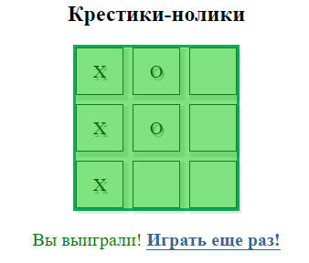
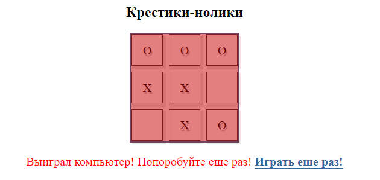

# Игра в крестики-нолики

Этот проект представляет собой простую браузерную игру в крестики-нолики, реализованную на JavaScript. Игра позволяет пользователю играть против компьютера.

## Особенности

- Простой и интуитивно понятный интерфейс
- Игра против компьютера, который делает случайные ходы
- Определение победителя и возможность начать новую игру после завершения

## Как использовать

1. Клонируйте репозиторий или загрузите файлы на свой компьютер.
2. Откройте файл `main.html` в вашем браузере.
3. Начните игру, выбрав ячейку для хода.

## Демонстрация

